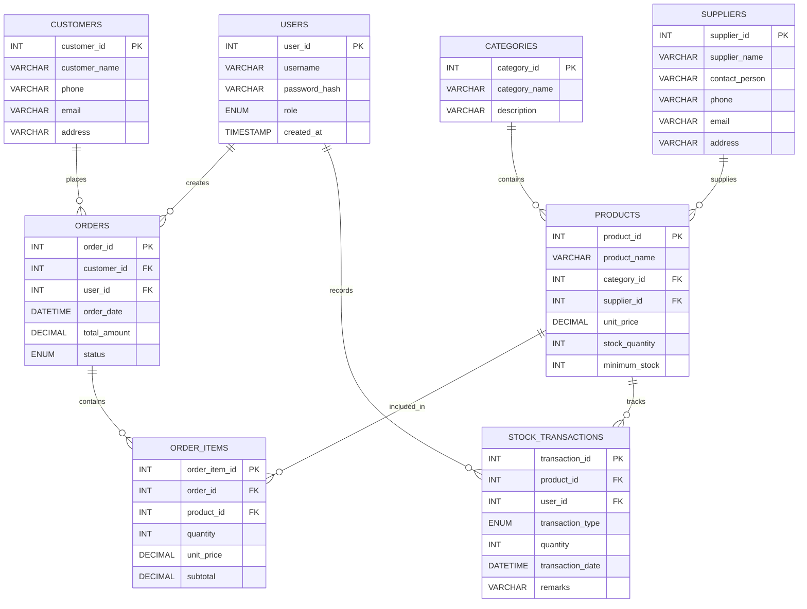
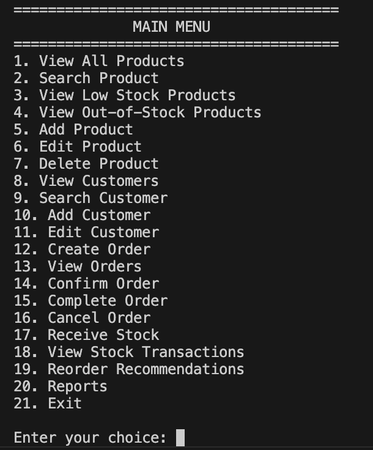
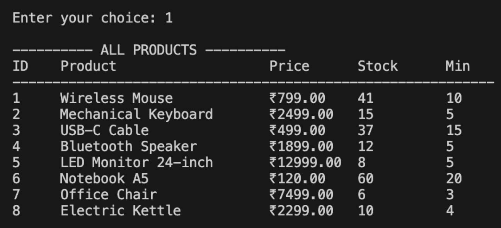
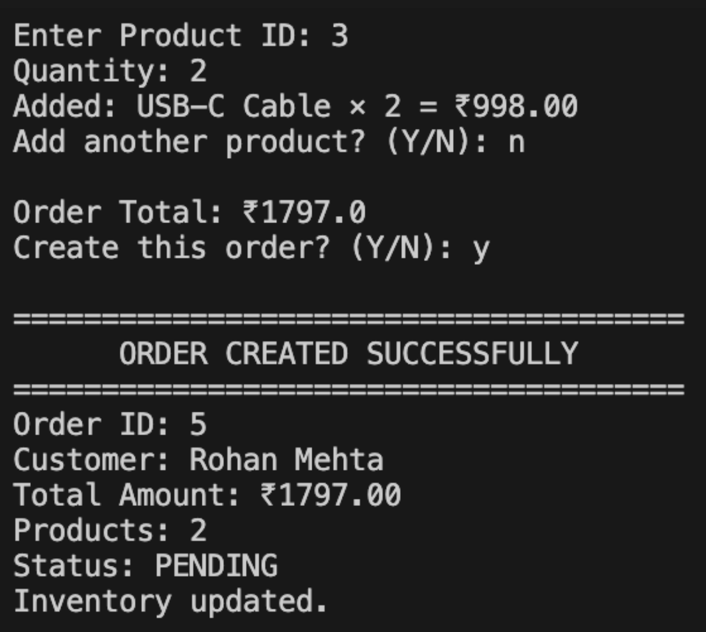
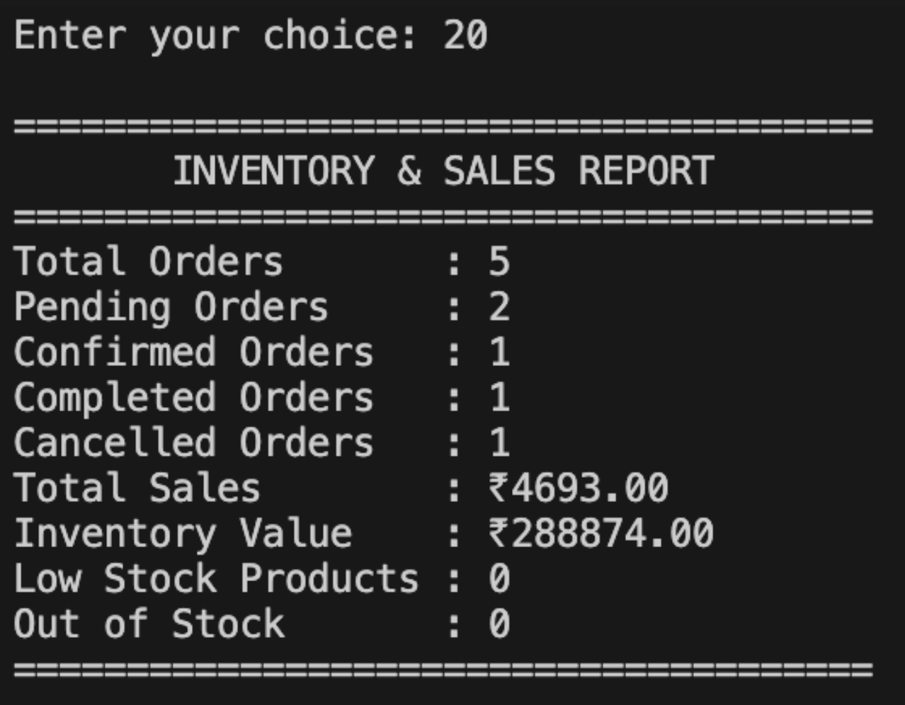
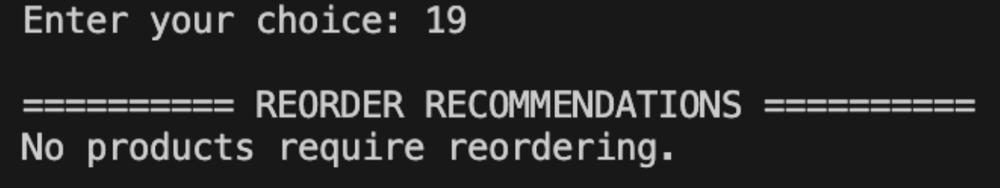

# Inventory & Order Management System

A Java-based console application for managing products, inventory, customers, suppliers, and sales orders using MySQL and JDBC.

## Overview

The Inventory & Order Management System simulates a real-world inventory and order workflow.

The system supports:

- Role-based user authentication
- Product and category management
- Supplier management
- Customer management
- Inventory tracking
- Stock receiving and adjustments
- Multi-product order creation
- Automatic stock deduction after sales
- Order confirmation, completion, and cancellation
- Stock restoration for cancelled orders
- Stock transaction history
- Low-stock and out-of-stock detection
- Reorder recommendations
- Inventory and sales reports

## Key Features

### User Management

- Admin and Staff roles
- BCrypt password hashing
- Role-based access to application functions

### Product Management

- Add products
- Edit products
- Delete products
- Search products
- Track unit prices
- Configure minimum stock levels

### Inventory Management

- Track current stock quantities
- Receive new stock
- Record stock transactions
- Detect low-stock products
- Detect out-of-stock products
- Generate reorder recommendations

### Order Management

- Create multi-product orders
- Calculate order totals
- Automatically deduct stock when products are sold
- Confirm orders
- Complete orders
- Cancel pending orders
- Restore stock when a sale is cancelled

### Reporting

The application provides summary reports including:

- Total orders
- Pending orders
- Confirmed orders
- Completed orders
- Cancelled orders
- Total sales
- Inventory value
- Low-stock product count
- Out-of-stock product count

## Technologies Used

- Java 17
- MySQL
- JDBC
- Maven
- BCrypt
- Object-Oriented Programming
- SQL
- Git & GitHub

## Architecture

The application follows a layered architecture:

```text
Console UI
    ↓
Service Layer
    ↓
Repository Layer
    ↓
JDBC
    ↓
MySQL Database
````

## Project Structure

```text
src/main/java/com/example/inventory
│
├── config
│   └── DatabaseConnection.java
│
├── model
│   ├── Product.java
│   ├── Category.java
│   ├── Supplier.java
│   ├── Customer.java
│   ├── User.java
│   ├── Order.java
│   ├── OrderItem.java
│   └── StockTransaction.java
│
├── repository
│   ├── ProductRepository.java
│   ├── CategoryRepository.java
│   ├── SupplierRepository.java
│   ├── CustomerRepository.java
│   ├── UserRepository.java
│   ├── OrderRepository.java
│   ├── OrderItemRepository.java
│   └── StockTransactionRepository.java
│
├── service
│   ├── ProductService.java
│   ├── CategoryService.java
│   ├── SupplierService.java
│   ├── CustomerService.java
│   ├── UserService.java
│   ├── OrderService.java
│   ├── StockService.java
│   └── ReportService.java
│
├── ui
│   └── ConsoleUI.java
│
├── util
│   └── PasswordUtil.java
│
└── App.java
```

## Database Design

The system uses the following main tables:

* `users`
* `categories`
* `suppliers`
* `products`
* `customers`
* `orders`
* `order_items`
* `stock_transactions`

### Entity Relationship Diagram



## Security

Database credentials are stored in a local configuration file:

```text
src/main/resources/application-local.properties
```

This file is excluded from Git using `.gitignore`.

Passwords are stored using BCrypt hashing rather than plain-text passwords.

## Screenshots

### Main Menu — Role-Based Inventory & Order Management



### Product & Inventory Management



### Multi-Product Order Processing



### Inventory & Sales Reporting



### Reorder Recommendations



## Setup

### 1. Clone the Repository

```bash
git clone https://github.com/Shreya-Godala05/inventory-order-management.git
cd inventory-order-management
```

### 2. Configure MySQL

Create the database:

```sql
CREATE DATABASE inventory_management;
```

Create the required tables:

* `users`
* `categories`
* `suppliers`
* `products`
* `customers`
* `orders`
* `order_items`
* `stock_transactions`

### 3. Configure Local Database Credentials

Create:

```text
src/main/resources/application-local.properties
```

Add:

```properties
db.url=jdbc:mysql://127.0.0.1:3306/inventory_management
db.username=root
db.password=YOUR_MYSQL_PASSWORD
```

Do not commit this file to GitHub.

### 4. Build the Project

```bash
mvn clean compile
```

### 5. Run the Application

```bash
mvn exec:java
```

## Example Workflow

```text
Login
  ↓
View/Search Products
  ↓
Create Customer
  ↓
Create Multi-Product Order
  ↓
Stock Automatically Deducted
  ↓
Confirm Order
  ↓
Complete Order
  ↓
View Reports
  ↓
Review Low Stock
  ↓
Receive New Stock
```

## Learning Outcomes

This project demonstrates practical experience with:

* Java OOP
* Layered application architecture
* JDBC database connectivity
* SQL and relational database design
* CRUD operations
* Authentication and authorization
* Password security
* Inventory workflows
* Order processing
* Transaction logging
* Business-rule implementation
* Maven dependency management
* Git and GitHub

## Future Enhancements

Possible future improvements include:

* Graphical user interface or web interface
* REST API
* Spring Boot migration
* Dashboard and data visualization
* Advanced sales analytics
* Automated supplier purchase orders
* Email notifications for low stock
* Database transaction management for multi-step orders

````

